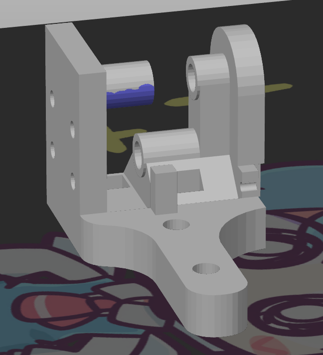
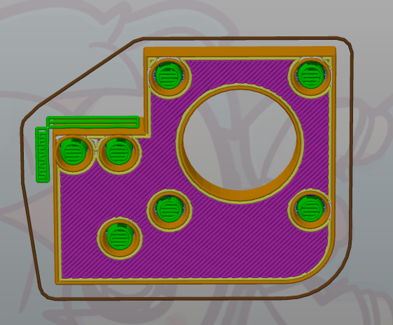

# Printing the parts

## Material

Rudy is designed to be easy to print. I used Devil Design PETG for every part. I can't really vouch for PLA working or not, but looking at the design it should be fine for everything but the AB motor mounts. ABS and nylon will most likely work. 

## Slicer

I use superslicer (analogous to prusaslicer), so I can only help with those. If you use cura or simplify3d or whatever, you probably know way more about it than I do anyway.

## Settings

Every part should be printed at 5mm solid walls. This means that if your wall thickness is 1mm, use 5 walls. If it's .8mm (common with .4 nozzles), use 5/.8 = 6.25 (6 or 7) walls. In superslicer you can set this at print settings/vertical_shells. Infill doesn't really matter, i used 18% gyroid. 

Some parts _will_ need suports turned on to make the CAD simpler. Generally "supports on build plate only" should get you most of the way there except the Y carriages where you will need paint-on, or tree support (more on that later).

Every part has a flat surface you can print it on.

## Printing the trickier parts

There are some parts that will need you to tweak settings a bit. Most notorious is gonna be the Y carriages. Use this image to paint on the supports.

For every other part you want the counterholes to be supported so they don't sag (especially if printing PETG)

## Part list

### SCROLL DOWN FOR UPDATED MK2 AND MK3 PARTS

Some parts you will have to mirror in your slicer. To do this in superslicer, right click the imported stl and click "mirror/along X axis". Only place the flat sides down after.

| file | pieces | second one mirrored? |
| --- | --- | --- |
| mgn9_mount_100mm.stl | 2 | no |
| mgn9_mount_150mm.stl | 2 | no |
| back_bottom.stl | 1 |  |
| back_top.stl | 1 |  |
| bed_frame.stl | 1 |  |
| bottom_corner.stl | 2 | no |
| foot_front.stl | 2 | yes |
| `^one mirrored only if you want the logo on the other side` |  |  |
| front_bar_mount.stl | 2 | yes |
| idlerv2-right.stl | 1 | mirror this part!! |
| idlerv2.stl | 1 |  |
| leg_back.stl | 2 | yes |
| motor_mount_A.stl | 2 | yes |
| motor_mount_B_spacer.stl | 1 |  |
| skirt.stl | 3 | no |
| spool_holder.stl | 1 |  |
| top_corner.stl | 2 | no |
| y_carriage_left (Mirror #1).stl | 1 |  |
| y_carriage.stl | 1 |  |
| foot_left_logo.stl | 1 |  |
| leveling_knob.stl | 3/4 | no |
| limit_switch_spacer.stl | 2 | no |
| logo_insert.stl | 1 |  |
| mgn_rail_stopper.stl | 2 | no |

## Part list for MK2

| file change | pieces | second mirrored? |
| --- | --- | --- |
| idlerv2-right.stl -> MK2/idlerv3_right.step| 1 |  |
| idlerv2.stl -> MK2/idlerv3_left.step| 1 |  |
| motor_mount_A.stl -> MK2/motor_mount_left.step | 2 | yes |
| top_corner.stl -> not needed|  |  |
| y_carriage_left -> MK2/y_carriage_v2.step | 1 |  |
| y_carriage.stl -> MK2/y_carriage_v2_right_mirrored.step | 1 |  |
| NEW PARTS |  |  |
| MK2/belt_tensioner_left.step | 2 | yes |

## Part list for MK3

| file change | pieces | second mirrored? |
| --- | --- | --- |
| bed_frame.stl -> not needed |  |  |
| NEW PARTS |  |  |
| MK3/Z_reprap_screw.step | 1 |  |
| MK3/Z_reprap_left.step | 2 | yes |
| MK3/Z_reprap_v0_front | 1 |  |
| MK3/Z_reprap_v0_side | 2 | no |
