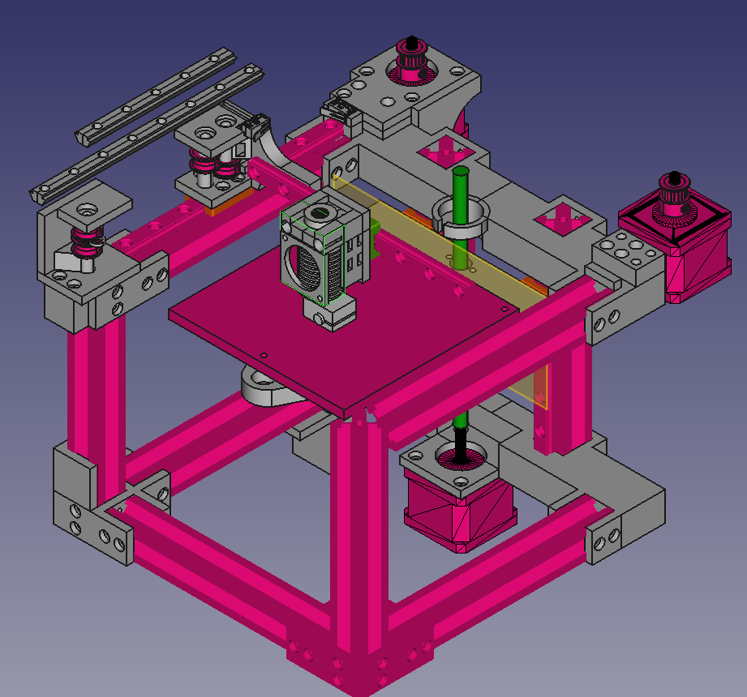

# Rudy

## A completely regular sized 3D printer that you can build

## BOM

| Thing |  |  |
| --- | --- | --- |
| 3x NEMA17 |  |  |
| GT2 things | $4.35 ($5.50) | [ali](https://www.aliexpress.com/item/4001148474252.html?spm=a2g0o.cart.0.0.3bee38daN6zSnp&mp=1) |
| 3010 fan | $0.75 ($1.90) | [ali](https://www.aliexpress.com/item/1005002675024799.html?spm=a2g0o.cart.0.0.3bee38daN6zSnp&mp=1) |
| literally any mainboard | $22.70 ($33.25) | [ramps](https://www.aliexpress.com/item/1005001631916842.html?spm=a2g0o.cart.0.0.3bee38daN6zSnp&mp=1) |

// i'm lazy to collect these rn, they will be here
// 2-300$ total

### Total: $38 ($60)