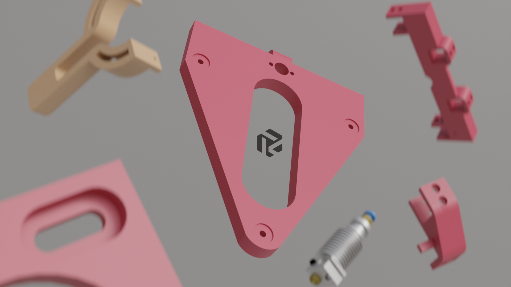

# Rudy

## What this _is_

It's a coreXY 3d printer that is

  - cheap
  - reliable
  - small
  - easy to build
  - easy to understand
  - easy to modify
  - open frame

## What this _ain't_

- The fastest printer in the west

- A zero compromise machine

- Something off the shelf

<a href="https://www.youtube.com/watch?v=9IVwhJpB8qE">
    See it in action
    
</a>

<a href="https://discord.com/invite/MBcHGUv2CB">
    Join the discord
    
</a>

---

## GUIDES

 - [Sourcing the parts](./SOURCING_GUIDE.md)
 - [Printing the files](./PRINTING_GUIDE.md)
 - [Choosing a toolhead](./TOOLHEAD.md)
 - [Assembly](./build_guide/assembly.md)