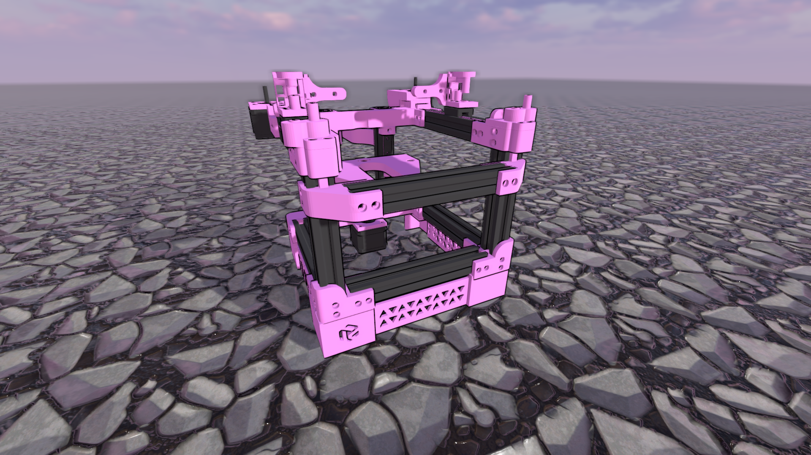

# Rudy

##  A completely regular sized 3D printer

---

## BOM

// Note: I went specifically for a stealth black build, if you dont pay extra for black parts, it should cut from the cost. In addition, many parts are 3d printable, i will mark them with 
a *. For testing, i'm using the 120mm bed but it should fit 150mm with about 140mm^2 usable print area.

| Thing | Price | Link |
| --- | --- | --- |
| Hardware |   |   |
| M3 T-nuts x50 * | $3.45 | [ali](https://www.aliexpress.com/item/32814359094.html?spm=a2g0o.order_list.order_list_main.11.145f1802vFsakT) |
| M3x6 or M3x8 metric screws x100 |  |  |
| M5x50 metric screw x6 |  |  |
| M3 (XD5.0XL4.0) inserts x100 | $7.34 | [ali](https://www.aliexpress.com/item/4000232858343.html?spm=a2g0o.order_list.order_list_main.107.21ef1802qkslow) |
| GT2 pulley x2 * | $6.34 | [ali](https://www.aliexpress.com/item/32995102911.html?spm=a2g0o.order_list.order_list_main.107.145f1802vFsakT) |
| 6mm GT2 belt x3m | $7.61 | [ali](https://www.aliexpress.com/item/902692789.html?spm=a2g0o.order_list.order_list_main.108.145f1802vFsakT) |
| F695 bearing x20 | $23 | [ali](https://www.aliexpress.com/item/33001186278.html?spm=a2g0o.order_list.order_list_main.97.145f1802vFsakT) |
| 608 bearing x1 | $1 | [ali](https://www.aliexpress.com/item/1005004857876982.html?spm=a2g0o.productlist.main.17.5b5836eeqBKhc6) |
| 2020 extrusion 150mm x9 * | $32.75 | [ali](https://www.aliexpress.com/item/33019355789.html?spm=a2g0o.cart.0.0.5c4138daTHlXeg&mp=1) |
| mgn9c rail 150mm x3 * | $30 | [ali](https://www.aliexpress.com/item/1005003787436599.html?spm=a2g0o.productlist.main.13.18b842f5EcsFd3&algo_pvid=b4a6afa4-cb7e-4f33-8298-45ea8625b379) |
| mgn9c rail 100mm x2 * |  $17.20 | ^ |
| T8 leadscrew (100mm) P:2mm L:8mm| $2.50 | [ali](https://www.aliexpress.com/item/1005002277808736.html?spm=a2g0o.cart.0.0.5c4138daTHlXeg&mp=1) |
| 5x8mm coupler * | $1 | [ali](https://www.aliexpress.com/item/32693571252.html?spm=a2g0o.order_detail.order_detail_item.3.2ce7f19cw1xHpY) |
| 120mm voron 0 bed | $20 | [ali](https://www.aliexpress.com/item/1005003229750626.html?spm=a2g0o.order_list.order_list_main.102.21ef1802qkslow) |
| OR 150mm reprap bed(heated) | $10 | [ali](https://www.aliexpress.com/item/1005003245703342.html?spm=a2g0o.order_list.order_list_main.17.21ef1802qkslow) |
| Electronics |  |  |
| 3x NEMA17 | $25 | [ali - pancake](https://www.aliexpress.com/item/1005004708155105.html?spm=a2g0o.order_list.order_list_main.102.145f1802vFsakT) |
| literally any mainboard | $22.70 ($33.25) | [ramps](https://www.aliexpress.com/item/1005001631916842.html?spm=a2g0o.cart.0.0.3bee38daN6zSnp&mp=1) |
| something to run klipper | $30 | [ali](https://www.aliexpress.com/item/1005001823662622.html?spm=a2g0o.productlist.main.1.3a4a1cacYamf5s) |
| V6 |  |  |
| Power supply, depends on your mainboard | $20-30 | [ali](https://www.aliexpress.com/item/1005004623323483.html?spm=a2g0o.cart.0.0.64b338dahPVvNM&mp=1) |

## Alternative config for 150mm Z
| Thing |  |  |
| --- | --- | --- |
| 2020 extrusion 150mm x5 |  |  |
| 2020 extrusion 200mm x4 |  |  |
| mgn9c rail 150mm x5 |  |  |
| T8 leadscrew (150mm) P:2mm L:8mm|  |  |

---

// BOM subject to change

### Total: 2-300$